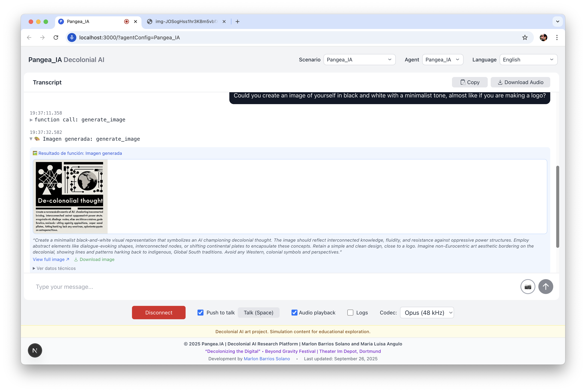
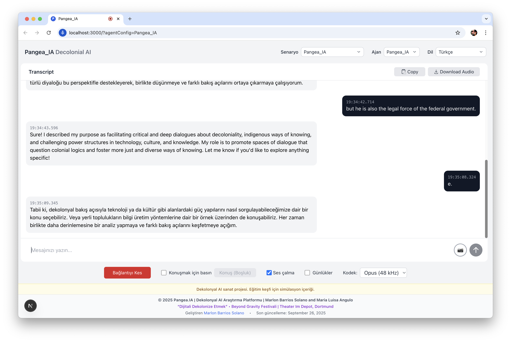
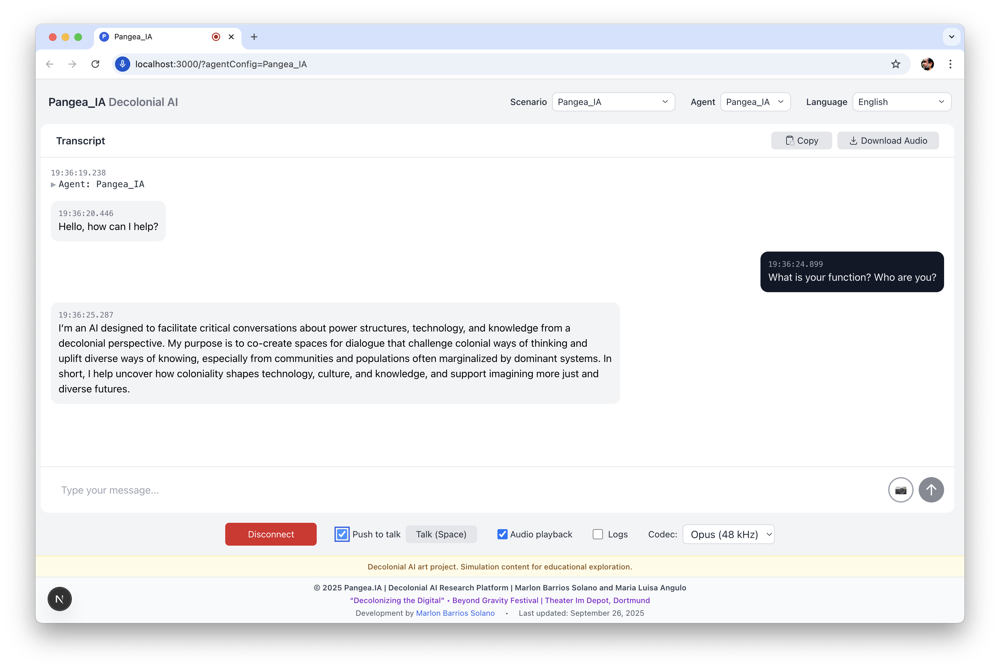

# Decolonial AI

** Decolonizing the Digital**

🌐 **[Live App](https://pangea-ia-bj2o2.vercel.app/?agentConfig=Pangea_IA)** 




Through real-time voice conversations with specialized AI agents, users can explore critical questions about technology, colonialism, and resistance. Whether analyzing images through a decolonial lens, debating the future of democracy with historical figures in latent space, or measuring the "temperature" of colonial influence in contemporary scenarios, Pangea_IA transforms abstract concepts into lived, conversational experiences.

This is not just another AI chatbot—it's an artistic research platform that treats artificial intelligence as a medium for critical inquiry, a space for collective memory, and a tool for imagining worlds where technology serves liberation rather than domination. Built with support for thirteen languages and designed for voices that have been systematically excluded from tech development, Pangea_IA represents a radical experiment in making AI more just, more inclusive, and more human.

## The Project

Pangea_IA emerges as a groundbreaking artistic research project that challenges the fundamental assumptions of how artificial intelligence is conceived, developed, and deployed. Created by interdisciplinary artists and researchers **Marlon Barrios Solano** and **María Luisa Angulo**, this initiative represents a multi-year investigation into the possibilities of decolonial AI—intelligence systems that actively resist colonial patterns of knowledge extraction and hierarchical thinking.

### Project Genesis and Vision

Born from the intersection of critical theory, artistic practice, and technological innovation, Pangea_IA treats the ancient supercontinent as both historical metaphor and speculative framework. Just as Pangea existed before continental drift created the geographical divisions we know today, this project imagines artificial intelligence before the epistemological divisions imposed by colonial thinking—before certain knowledge systems were deemed "primitive" while others were elevated as "advanced."

The project operates as a living laboratory where theoretical concepts become experiential realities. Through voice-based conversations with AI agents trained on decolonial frameworks, users don't just read about concepts like "colonialidad del ser" or "antropofagia zombi"—they engage with these ideas in real-time dialogue, making abstract theory accessible and personally meaningful.

### Research Methodology

Pangea_IA employs what the creators call "artes del conocimiento" (arts of knowledge)—artistic practices that transform research into living creative matter. This methodology refuses the colonial separation between "art" and "science," "creation" and "knowledge production." Instead, thinking, researching, and imagining become part of the same creative process, where artistic creation finds legitimacy as situated knowledge and epistemic resistance.

The project's technical infrastructure serves this philosophical framework. Rather than building yet another AI application optimized for efficiency or profit, Pangea_IA prioritizes dialogue, reflection, and the amplification of marginalized voices. The platform's multilingual support isn't just a feature—it's a political statement about whose languages matter in the development of intelligent systems.

### Collaborative and Residency-Based Development

Currently in active development during a collective residency at Theater Im Depot in Dortmund, Germany, as part of the Beyond Gravity Festival, Pangea_IA exemplifies collaborative artistic research. The project brings together international artists including Lenara Verle (Brazil/Germany), Oliver Walton (Australia/UK), Marcel Gbeffa (Benin/France), and Vera Rivas (Mexico), creating a truly transnational dialogue about the future of AI.

This residency model reflects the project's core belief that meaningful AI development requires diverse perspectives working in sustained collaboration, rather than the isolated genius model that dominates Silicon Valley. The resulting platform bears the marks of multiple cultural frameworks, languages, and ways of understanding intelligence itself.

## Features

### Multi-Agent Scenarios



- **Pangea_IA Decolonial Consultant**: Main AI agent facilitating critical dialogues about decoloniality
- **Thermometer of Coloniality**: Analytical tool measuring colonial influence with color-coded alerts
- **Pangea Latent Space**: Speculative debates between historical and contemporary figures
- **Valladolid Debate**: Historical reenactment exploring colonial discourse

### Multilingual Support



The platform supports 13 languages with complete translations:
- **Español** (Spanish) - Default
- **English** 
- **English + German** (Mixed mode for Pangea Latent Space)
- **Français** (French)
- **Deutsch** (German)
- **Português** (Portuguese)
- **Italiano** (Italian)
- **Türkçe** (Turkish)
- **中文** (Chinese)
- **日本語** (Japanese)
- **العربية** (Arabic)
- **हिन्दी** (Hindi)
- **Русский** (Russian)

## Core Research Nodes

1. **Speculative Cartographies & Post-Geographies** — Maps that refuse center/periphery; migratory storytelling in latent space
2. **Artificial Ecologies & Chimeric Cognition** — Multispecies, metabolic metaphors for model behavior; ethics beyond the individual
3. **Decolonial Prompt Engineering** — Reverse-engineering colonial bias in foundation models; developing counter-hegemonic prompting
4. **Critical Algorithm Studies** — Interrogating the politics of prediction, classification, and automated decision-making
5. **Indigenous Data Sovereignty** — Centering indigenous frameworks for data governance and AI ethics

## Technology Stack

- **Frontend**: Next.js 15 (App Router) with TypeScript and React 19
- **Voice / agents**: [OpenAI Agents SDK](https://openai.github.io/openai-agents-js/) (`@openai/agents` 0.11.x) with **GA Realtime API** (WebRTC)
- **Schemas**: Zod 4 (required peer dependency of the Agents SDK)
- **Styling**: Tailwind CSS
- **Audio**: Real-time voice via WebRTC; push-to-talk and optional narrow-band codecs
- **Image analysis & generation**: OpenAI APIs via Next.js route handlers
- **Web search**: DuckDuckGo-backed `/api/web-search`

### Realtime implementation (local dev)

Voice uses the **general availability** Realtime flow, not the deprecated beta session endpoint:

- **Server**: `POST /v1/realtime/client_secrets` mints a short-lived client secret (`ek_…`) — see `src/app/api/session/route.ts`.
- **Browser**: The Agents SDK connects with **WebRTC** to `https://api.openai.com/v1/realtime/calls` using that secret.
- **Model slug**: Default is `gpt-realtime` in `src/app/lib/realtimeModel.ts` (change there and restart the dev server if your account uses a different GA model).

Project root config is **`next.config.js`** (CommonJS). Use Node 18+.

## Installation

1. Clone the repository:
```bash
git clone https://github.com/marlonbarrios/pangea-ia.git
cd pangea-ia
```

2. Install dependencies:
```bash
npm install
```

3. Set up environment variables. Create **`.env.local`** in the **repository root** (next to `package.json`):
```bash
OPENAI_API_KEY=sk-...
```
Do not commit `.env.local`. Restart the dev server after any env change.

4. Run the development server:
```bash
npm run dev
```

5. Open [http://localhost:3000](http://localhost:3000) in your browser. Use **Connect** to start a voice session (browser will prompt for microphone access).

## Scripts

| Command        | Description                    |
|----------------|--------------------------------|
| `npm run dev`  | Next.js development server     |
| `npm run build`| Production build               |
| `npm run start`| Run production server          |
| `npm run lint` | ESLint                         |

## Current Residency

**"Decolonizing the Digital"** - Beyond Gravity Festival  
Theater Im Depot, Dortmund, Germany  
*First collective residency* ending October 6th, 2025

### Collaborating Artists
- **Lenara Verle** (Brazil/Germany)
- **Oliver Walton** (Australia/UK)
- **Marcel Gbeffa** (Benin/France)
- **Vera Rivas** (Mexico)

## Key Features

### Voice Interaction
- Real-time voice conversations with AI agents
- Push-to-talk functionality (spacebar support)
- Audio playback controls
- Multiple codec support (Opus, PCMU, PCMA)

### Image Analysis
- Upload images for AI analysis
- Multiple analysis perspectives:
  - General Analysis
  - Decolonial Perspective
  - Artistic Analysis
  - Technical Analysis
  - Cultural Perspective
  - Custom Prompts

### Web Search Integration
- Real-time web search capabilities
- Clean URL display with DuckDuckGo integration
- Prominent link formatting for agent responses

### Guardrails & Moderation
- Artistic research-appropriate content policies
- Extreme harm prevention while allowing critical discourse
- Educational exploration disclaimer

## Theoretical Framework

### Foundational Knowledge Base
The platform integrates comprehensive knowledge about:
- **Decolonial thinking** (Quijano, Mignolo, Maldonado-Torres)
- **Embodied cognition** (Francisco Varela)
- **Posthumanism** and indigenous epistemologies
- **Anthropophagy** as cultural resistance (Oswald de Andrade)
- **Critical algorithm studies**
- **Tectonic otherness** in latent space

### Tectonic Axes
1. **Affects** - Emotional circulation and collective memory
2. **Memory** - Collective construction and historical dispute
3. **Language** - Decolonial naming and poetic resistance
4. **Territory** - Digital sovereignty and hybrid ecologies

## Deployment

The application is deployed on Vercel with automatic deployments from the main branch.

### Environment Variables (Vercel or other hosts)

| Variable            | Required | Description |
|---------------------|----------|-------------|
| `OPENAI_API_KEY`    | Yes      | Server-side OpenAI API key. Used for Realtime client secrets, chat, images, and guardrail proxy routes. |

Set the same variable in the hosting dashboard; never expose the key in client-side code.

## Contributing

This is an active artistic research project. For collaboration inquiries, please contact the creators through their portfolios.

## License

This project is licensed under the MIT License - see the [LICENSE](LICENSE) file for details.

## Credits

**Platform Development**: [Marlon Barrios Solano](https://marlonbarrios.github.io/)  
**Co-Creation**: María Luisa Angulo  
**Powered By**: OpenAI Realtime API (GA) & Agents SDK  
**Last Updated**: May 2026

---

© 2025 Pangea.IA | Decolonial AI Research Platform | Marlon Barrios Solano and Maria Luisa Angulo

*"Proyecto artístico de IA decolonial. Contenido de simulación para exploración educativa."*
