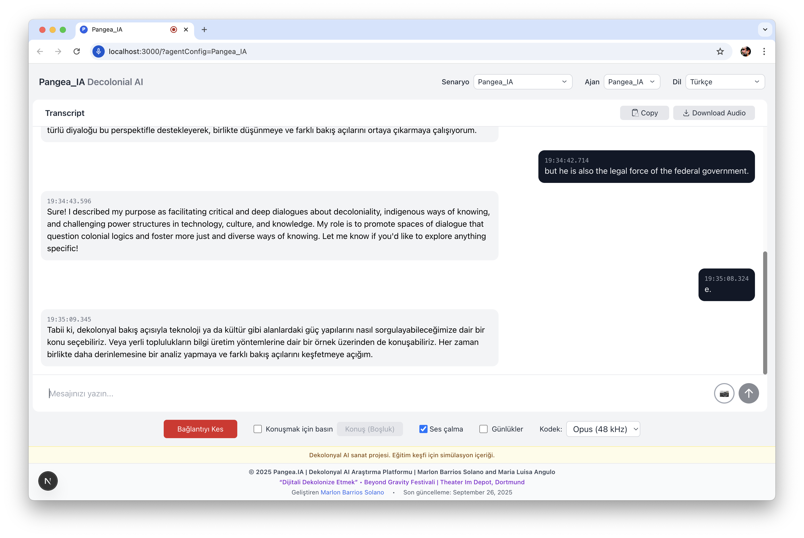

# Pangea_IA

**Plataforma de IA Decolonial - Decolonizing the Digital**

A decolonial AI research platform that explores critical approaches to artificial intelligence from Global South perspectives and Indigenous epistemologies.


## Overview

Pangea_IA is an artistic research platform developed by **Marlon Barrios Solano** and **María Luisa Angulo** that treats the ancient supercontinent Pangea as an epistemic metaphor: a world in motion, where borders are provisional and knowledge travels. The platform prototypes decolonial strategies for AI and explores how artificial intelligence can serve justice, diversity, and pluriversal thinking.

## Features

### Multi-Agent Scenarios



- **Pangea_IA Decolonial Consultant**: Main AI agent facilitating critical dialogues about decoloniality
- **Thermometer of Coloniality**: Analytical tool measuring colonial influence with color-coded alerts
- **Pangea Latent Space**: Speculative debates between historical and contemporary figures
- **Valladolid Debate**: Historical reenactment exploring colonial discourse

### Multilingual Support


The platform supports 13 languages with complete translations:
- **Español** (Spanish) - Default
- **English** 
- **English + German** (Mixed mode for Pangea Latent Space)
- **Français** (French)
- **Deutsch** (German)
- **Português** (Portuguese)
- **Italiano** (Italian)
- **Türkçe** (Turkish)
- **中文** (Chinese)
- **日本語** (Japanese)
- **العربية** (Arabic)
- **हिन्दी** (Hindi)
- **Русский** (Russian)

## Core Research Nodes

1. **Speculative Cartographies & Post-Geographies** — Maps that refuse center/periphery; migratory storytelling in latent space
2. **Artificial Ecologies & Chimeric Cognition** — Multispecies, metabolic metaphors for model behavior; ethics beyond the individual
3. **Decolonial Prompt Engineering** — Reverse-engineering colonial bias in foundation models; developing counter-hegemonic prompting
4. **Critical Algorithm Studies** — Interrogating the politics of prediction, classification, and automated decision-making
5. **Indigenous Data Sovereignty** — Centering indigenous frameworks for data governance and AI ethics

## Technology Stack

- **Frontend**: Next.js 15.5.2 with TypeScript
- **AI Integration**: OpenAI Realtime API for voice interactions
- **Styling**: Tailwind CSS with custom decolonial design
- **Audio**: Real-time voice communication with push-to-talk support
- **Image Analysis**: AI-powered image analysis with multiple perspectives
- **Web Search**: Integrated web search capabilities with clean URL display

## Installation

1. Clone the repository:
```bash
git clone https://github.com/marlonbarrios/pangea-ia.git
cd pangea-ia
```

2. Install dependencies:
```bash
npm install
```

3. Set up environment variables:
```bash
cp .env.example .env.local
# Add your OPENAI_API_KEY
```

4. Run the development server:
```bash
npm run dev
```

5. Open [http://localhost:3000](http://localhost:3000) in your browser.

## Current Residency

**"Decolonizing the Digital"** - Beyond Gravity Festival  
Theater Im Depot, Dortmund, Germany  
*First collective residency* ending October 6th, 2025

### Collaborating Artists
- **Lenara Verle** (Brazil/Germany)
- **Oliver Walton** (Australia/UK)
- **Marcel Gbeffa** (Benin/France)
- **Vera Rivas** (Mexico)

## Key Features

### Voice Interaction
- Real-time voice conversations with AI agents
- Push-to-talk functionality (spacebar support)
- Audio playback controls
- Multiple codec support (Opus, PCMU, PCMA)

### Image Analysis
- Upload images for AI analysis
- Multiple analysis perspectives:
  - General Analysis
  - Decolonial Perspective
  - Artistic Analysis
  - Technical Analysis
  - Cultural Perspective
  - Custom Prompts

### Web Search Integration
- Real-time web search capabilities
- Clean URL display with DuckDuckGo integration
- Prominent link formatting for agent responses

### Guardrails & Moderation
- Artistic research-appropriate content policies
- Extreme harm prevention while allowing critical discourse
- Educational exploration disclaimer

## Theoretical Framework

### Foundational Knowledge Base
The platform integrates comprehensive knowledge about:
- **Decolonial thinking** (Quijano, Mignolo, Maldonado-Torres)
- **Embodied cognition** (Francisco Varela)
- **Posthumanism** and indigenous epistemologies
- **Anthropophagy** as cultural resistance (Oswald de Andrade)
- **Critical algorithm studies**
- **Tectonic otherness** in latent space

### Tectonic Axes
1. **Affects** - Emotional circulation and collective memory
2. **Memory** - Collective construction and historical dispute
3. **Language** - Decolonial naming and poetic resistance
4. **Territory** - Digital sovereignty and hybrid ecologies

## Deployment

The application is deployed on Vercel with automatic deployments from the main branch.

### Environment Variables
- `OPENAI_API_KEY`: Required for AI functionality
- Other environment variables as specified in `.env.example`

## Contributing

This is an active artistic research project. For collaboration inquiries, please contact the creators through their portfolios.

## License

See [LICENSE](LICENSE) file for details.

## Credits

**Platform Development**: [Marlon Barrios Solano](https://marlonbarrios.github.io/)  
**Co-Creation**: María Luisa Angulo  
**Powered By**: OpenAI Realtime API  
**Last Updated**: December 2024

---

© 2025 Pangea.IA | Decolonial AI Research Platform | Marlon Barrios Solano and Maria Luisa Angulo

*"Proyecto artístico de IA decolonial. Contenido de simulación para exploración educativa."*